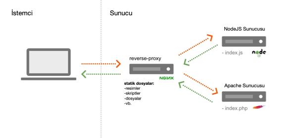

# Apache ve Nginx ile Tersine Vekil Sunucu Örneği
Bu örnek Apache ve Nginx sunucuları kullanarak tersine vekil sunucusunun nasıl oluşturulacağı göstermektedir.
* Apache sunucusu üzerinde PHP diliyle yazılmış basit bir API örneği yer almaktadır. Sunucu 8000 portunda çalışmaktadır.
* NodeJS sunucusunda PHP ile yazılmış API'yi tüketen basit bir uygulama çalışmaktadır. Sunucu 3000 portunda çalışmaktadır.
* Nginx tersine vekil sunucusu (reverse proxy) olarak çalışmaktatır. Sunucu ayarları nginx klasöründe default.conf dosyasında yer almaktadır. Sunucu 80 portunda çalışmaktadır.
* Docker-compose ile 3 farklı servis oluşturularak birbirine bağlantı yapılmıştır.

## Çalıştırma
* nodejs klasörüne gidilerek `npm install` ile gerekli bağımlılıklar yüklenir.
* `docker-compose up` komutu ile kapsayıcılar oluşturulur ve çalıştırılır.
* [localhost:8000/api](localhost:8000/api) ve [localhost:8000/api?id=1](localhost:8000/api?id=1)adreslerinde API çalışmaktadır
* [localhost:8000](localhost:8000) adresinde uygulamanın kendisi çalışmakta, Nginx anasayfayı arkaplanda 3000 portunda çalışan NodeJS uygulamasına yönlendirmektedir.

